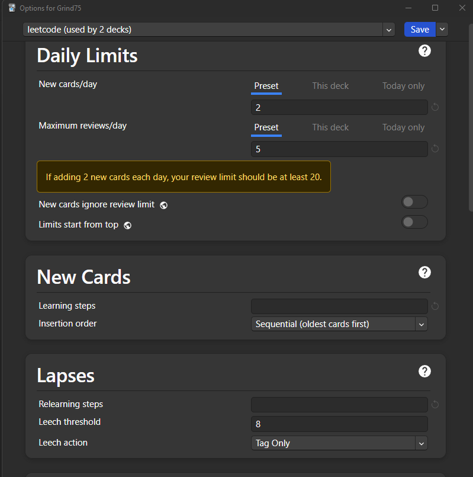
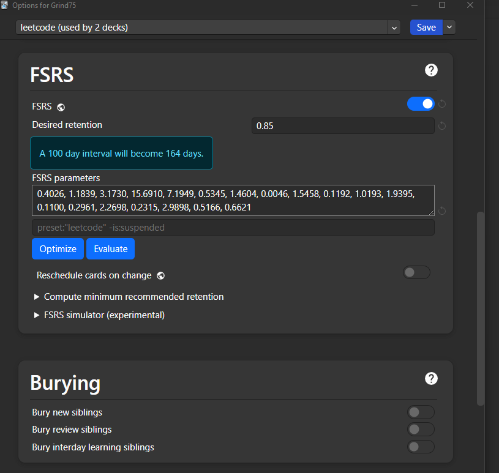

# Anki Deck to *schedule* Leetcode Grind 75 problems

This repository contains an Anki deck to help you *schedule* Leetcode problems. The idea for this deck was heavily inspired by a [Reddit post](https://www.reddit.com/r/Anki/comments/1iep67l/memorising_leetcode_by_using_anki_as_a_scheduler/) and [Skerritt's blog post](https://skerritt.blog/memorising-leetcode-by-using-anki-as-a-scheduler/), which mentioned using Anki as a *scheduler* to practice Leetcode problems.

In the referenced blog post, an Anki deck containing questions from the ["Netcode 150"](https://neetcode.io/roadmap) was provided. However, if you're short on time or want a more focused selection of problems, the [**Grind 75**](https://www.techinterviewhandbook.org/grind75/) deck may be more suitable.

## What’s Included
- **Anki Deck**: The actual Anki deck that you can import and start using right away.
- **CSV File**: A customizable CSV file with the list of Leetcode problems, which you can modify based on your preferences.

## What This Deck Is Not
- **No Solutions or Explanations**: This deck does not include explanations for the problems. It is meant solely as a tool for scheduling the practice of problems, not for memorizing algorithms.

## Anki Settings Used (from the blog post)
Feel free to adjust the settings according to your needs, but these are the ones I personally use to schedule the problems efficiently.

---

